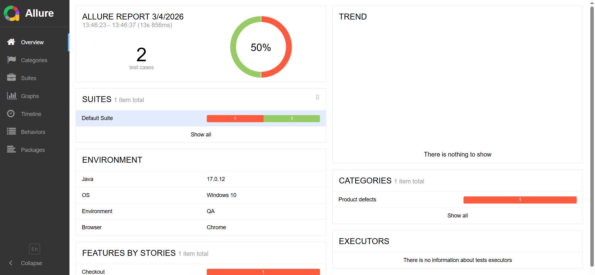
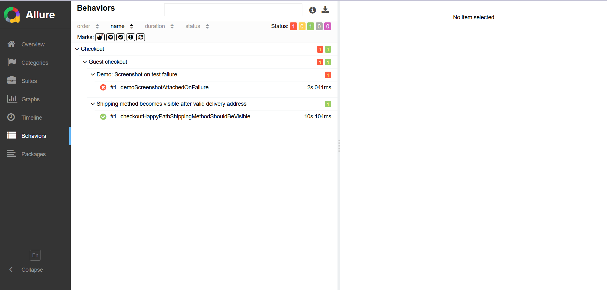

# UI Automation Demo Framework

Demo UI automation framework built with Java, Selenium, TestNG and Allure.

## Tech Stack
- Java
- Selenium WebDriver
- TestNG
- Maven
- Allure Reports

## How to run tests
mvn clean test

## Allure report

Example Allure report generated after test execution:

### Overview

### Behaviors

### Quick local view
allure serve target/allure-results

### Generate static report
allure generate target/allure-results -o target/allure-report --clean
allure open target/allure-report